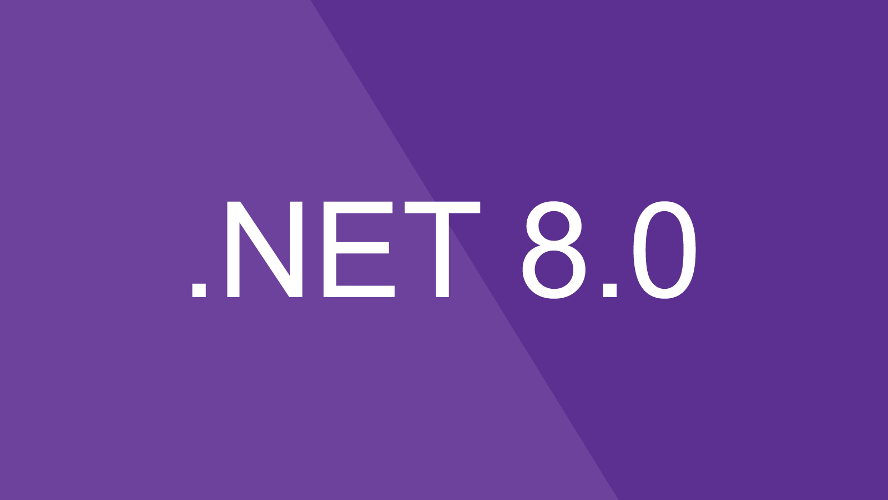

<!-- PROJECT LOGO -->
 

  

  <h3 align="center"> Financial Data - Unit Tests </h3>

  

    A toolkit that showcases the testing of historical financial data through both the objective and subjective approach.
  

<!-- TABLE OF CONTENTS -->

  
Table of Contents

  <ol>
    <li>
      <a href="#about-the-project">About The Project</a>
      <ul>
        <li><a href="#built-with">Built With</a></li>
      </ul>
    </li>
    <li>
      <a href="#getting-started">Getting Started</a>
      <ul>
        <li><a href="#prerequisites">Prerequisites</a></li>
        <li><a href="#installation">Installation</a></li>
      </ul>
    </li>
    <li><a href="#usage">Usage</a></li>
    <li><a href="#license">License</a></li>
  </ol>

<!-- ABOUT THE PROJECT -->
## About The Project
This repository provides a comprehensive toolkit for testing historical financial data using both objective and subjective approaches. The objective tests focus on validating data integrity through concrete rules, such as ensuring the Open price is lower than the Low for that day and positive trading volumes, while the subjective tests compare data from multiple sources, selecting the most reliable one using metrics like Least Mean Squared Error (LMSE). With well-documented code snippets and examples, this repository serves as a valuable resource for developers and analysts looking to ensure the accuracy and quality of market data in financial models. Whether you're new to finance or an experienced professional, the toolkit simplifies the process of validating historical data.

(<a href="#readme-top">back to top</a>)

### Built With

The project was built using the following frameworks/languages. Make sure to have the frameworks installed in order to run the project.
   

  

(<a href="#readme-top">back to top</a>)

<!-- GETTING STARTED -->
## Getting Started

This is an example of how you may give instructions on setting up your project locally.
To get a local copy up and running follow these simple example steps.

<ol>
  <li>Make sure to have .NET 8 installed on your machine </li>
</ol>
